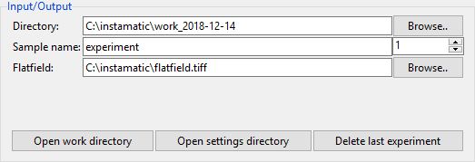
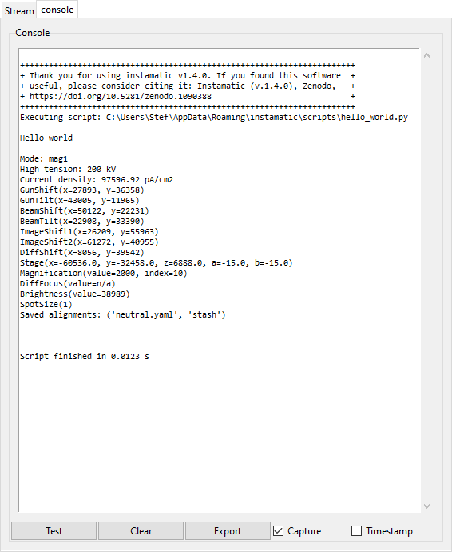
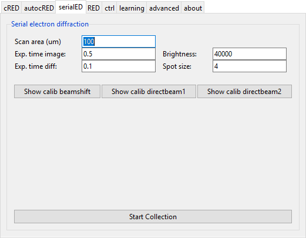
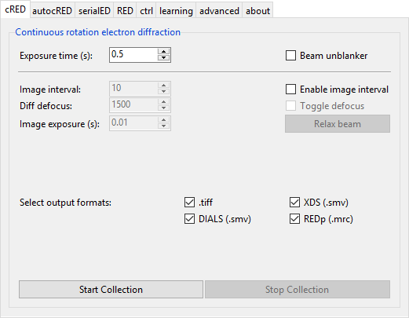
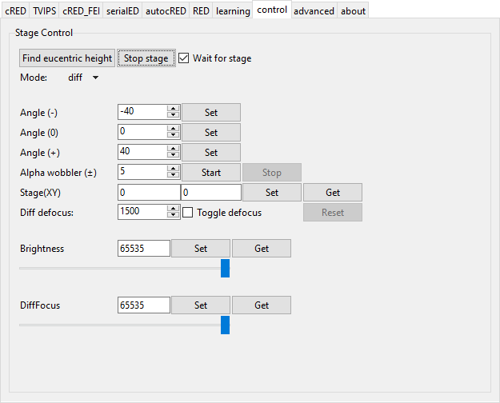
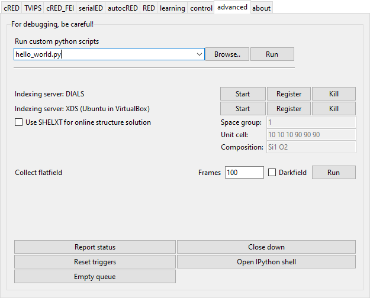

# GUI and module system

## Usage

Start the gui by typing `instamatic` in the command line.

On the left side, a live view of the camera will be shown if the camera can be streamed, such as the Timepix. On the top, there are some fields to change the output of the view. The exposure time for the live view, brightness, and display range can be changed here. Pressing the `Save Image` button will dump the current frame to a tiff file in the active directory.

On the right side, there is a pane for file i/o, and the available modules for data collection.

Each of the modules can be turned off (except the io module) in the `settings.yaml`.

## Data i/o

Module: `io`

This panel deals with input and output of the experimental data.

**Directory**  
: Root directory to work in. By default this is `C:/instamatic/$date/`

**Sample name and number**  
: This determines the subdirectory where experimental data are stored.
The number is automatically incremented when a new experiment is started. Data are never overwritten.

**Flatfield**  
: Here the path to the flatfield image can be specified. The default
value is read from `config/settings.yaml` and can be left blank if no flatfield should be used.

**Open work directory**  
: Open the current work directory, which is a combination of the root
directory, sample name, and experiment number. In this case `C:/instamatic/work_2017-11-19/experiment_1`. All experimental data for the current experiment will be saved here.

**Open config directory**  
: By default `%APPDATA%/instamatic/`. The configuration files for the
microscope, camera, and calibration files go here.

**Delete last experiment**  
: Sometimes, a data collection will go wrong... Pressing this button will
mark the last experiment directy for deletion. It will not actually delete anything, but you will at least know which ones to delete afterwards :-)

## Console

Module: `console`

If enabled, this panel logs the console output.

**Test**  
: Print a test message.

**Clear**  
: Clears the console.

**Export**  
: Opens a file browser to export the console output to a text file

**Capture**  
: Check this toggle to redirect the output from `stdout`.

**Timestamp**  
: Check this toggle to prepend timestamps to each message.

## SerialED data collection

Module: `sed`

Serial electron diffraction (serialED) is a technique to collect diffraction data on a large number of crystals. One diffraction pattern per crystal is collected. These can then be combined for structure determination, or used for screening/phase analysis.

Data collection can be started from the ‘serialED’ tab by pressing the ‘Start Collection’ button. Follow the instructions in the terminal to setup and calibrate the experiment.

**Scan area**  
: Radius for the area to scan area for crystals (in micrometer).

**Exp. time image**  
: Exposure time for images.

**Exp. time diff**  
: Exposure time for diffraction pattern.

**Brightness**  
: Default value for the brightness of the focused beam.

**Spot size**  
: Spot size to use.

## cRED data collection

Module: `cred`

Continuous RED (cRED) data collection can be started from the `cRED` tab.

The data collection procedure can be initiated by pressing ‘Start Collection’. The program will then wait for the rotation to start. The moment the pedal is pressed to start the rotation, the program will start the data collection with the specified options. Do not release your foot until after you press ‘Stop Collection’. This will signal the program to stop data collection, and write the images. Images are written in TIFF, MRC, and SMV format. Input files for REDp (.ed3d) and XDS (XDS.INP) are also written.

**Exposure time**  
: change the data collection time for each image.

**Beam unblanker**  
: If this option is selected, the beam will be automatically unblanked
when data collection starts, and blanked after data collection has finished (i.e. after ‘Stop Collection’ has been pressed)

### Image interval

With this feature, an image of the crystal will be shown every N frames. This is useful to control the position of the crystal in the beam for more reliable and reproducable data collections. This is achieved by applying a small defocus (diffraction focus) to every Nth image. a small defocus of the diffraction focus. If the defocus is large enough, this will show a view of the crystal in the aperture.

**Enable Image interval**  
: This option will enable the image interval.

**Image interval**  
: Change the interval at which the image will be defocused. For example,
if the value is 10, then every 10th image will be defocused.

**Diff. defocus**  
: This is the defocus value to apply. It is better not to make this value
too large, because the larger the difference with the proper diffraction focus, the longer the lenses need to recover. The microscope has to switch to the defocus value, take an image, and back within the time it takes to collect a single image (i.e. 0.5 s in this example).

**Toggle defocus**  
: This toggle applies the defocus value, which is used for checking. It
does not affect the data collection.

Other specific cRED modules: `cred_fei`, `cred_tvips`, `autocred`

## RED data collection

Module: `red`

Simple module to collect electron diffraction using discrete rotation steps.

Pressing `Start Collection` will collect a series of frames with the given tilt step and range. The data collection is then paused, enabling the user to recenter the crystal or finalize the data collection. The program will automatically switch to diffraction mode if it is in image mode, and go back to image mode afterwards. Pressing `Continue` will continue from the current point, and collect another series of frames with the given tilt range. Pressing `Finalize` will, not unsurprisingly, finalize the data collection, save the data, and write any input files.

**Exposure time**  
: The exposure time for each frame in seconds

**Tilt range**  
: The total tilt range for the next sequence in degrees

**Step size**  
: The step size in degrees

Data are output to `.tiff` and `.mrc`, including input files to read the data in PETS and REDp.

## FastADT data collection

Module: `fast_adt`

A generic module used to run cRED experiments where the tracking is done a priori i.e. in a swoop directly preceding the diffraction experiment.

Before the experiment, decide on diffraction and tracking modes to be used. The diffraction can be collected as a series of static `stills` or a `continuous` movie. In the latter case, the rotation speed (upon calibration via `instamatic.calib_stage_rotation`) will be established automatically. If desired, a `manual` crystal tracking path can be also requested. Tracking is done just before the experiment. A series of images with crystal positions at different angles will be collected and user will be requested to point on points to measure and then confirm by clicking on the image stream.

For optimum performance, the FastADT frame uses three separate TEM setting which need to be preemptively set up by the user. The "Image", "Tracking" and "Diffraction" settings are used when collecting the respective kinds of images. They are saved between microscope sessions.

**Diffraction mode**  
: `stills` or `continuous`, used to switch between rotation and stills/precession-assisted experiment.

**Diffraction start (deg)**  
: The tilt series/swipe starting angle in degrees.

**Diffraction stop (deg)**  
: The tilt series/swipe ending angle in degrees.

**Diffraction step (deg)**  
: The target spacing between angles at which subsequent diffraction images are collected within the tilt series/swipe in degrees.

**Diffraction exposure (s)**  
: The time taken to collect each diffraction image in seconds. In the `continuous` mode it will additionally dictate the rotation speed.

**Tracking mode**
: Dictates whether `none` or `manual` tracking is to be performed at the start of the experiment.

**Tracking step (deg)**
: The target spacing between angles at which subsequent tracking images are collected within the tracking series in degrees.

**Tracking exposure (s)**
: The time taken to collect each tracking image in seconds.

The function of config settings' `store` / `restore` buttons has been described above. The `start` button starts the (tracking and then) experiment. Further information and instructions concerning the `fast_adt` experiment may appear in the window and in the console. Collected data is automatically output in all available formats to the target directory at the end of experiment.

## Machine learning

Module: `machine_learning`

Running `instamatic.learn` on a series of diffraction patterns collected by SerialED will use a deep convoluted neural network to classify the images in 'good' and 'bad' quality, i.e. those with nice looking diffraction spots are separted from those with powder rings, no signal, lots of overlapping crystals.

The data can be loaded into this tab, to navigate back to the selected crystals.

## Control

Module: `ctrl`

This module allows some control over the microscope from the GUI and is updated as needed. At the moment, controls to control the stage position have been implemented, as well as a basic alpha wobbler which will rock the stage back and forth to find the eucentric height for rotation.

## Advanced

This module gives access to several debugging functions, as well as more advanced features.

It also gives the option to run custom python scripts from the GUI. The scripts give access to the `ctrl` variable, an instance of TEMController. The scripts are picked up from the directory `%APPDATA/Instamatic/scripts` or as defined by the `Instamatic` environment variable.

It is also possible to associate an indexing server with the data collection (currently `cred`, `autocred`), which will attempt to index the data immediately after data collection

There are also functions to collect a flatfield image.

`Report status` will report the current status of the microscope to the command line.

`Close down` will close down the microscope. It is associated to the script `close_down.py` in the scripts directory. It is meant to put the microscope in a state so that the sample can be removed, this means it will neutralize the sample stage, put down the fluorescence screen, maximize the brightness, etc.

`Open IPython shell` will open an IPython shell, so that the program state or microscope can be directly interacted with.

`Reset triggers` and `Empty queue` are for debugging, and probably redundant at this stage.

Module: `debug`

## About

Module: `about`
